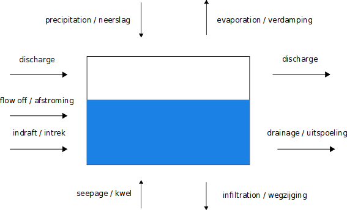
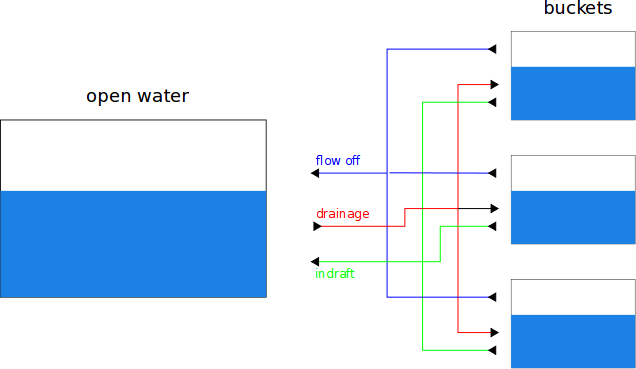

Problem background
------------------

A waterbalance is a quantitive view of the water flows that are going into or
coming out of a water body. The following picture shows these flows:

For some flows both the english and dutch term are given. We explain some of
these flows:

discharge
  flow that is generated by a pumping station [#fn1]_ that either pumps water
  into or out of the water body.

flow off
  incoming flow that is generated by a surplus of water on the areas that
  surround the water body

indraft
  incoming flow that trickles through the ground and that stems from areas that
  surround the water body

drainage
  outgoing flow that trickles through the ground and goes to the areas that
  surround the water body

The picture above forms the basic element to compute a waterbalance. Once you
have quantified the flows depicted in the picture, you can compute the volume
of water present in the water body.

In general, as a modeller you manually defined the following time series or use
actual measured time series:

  - precipitation;
  - evaporation;
  - seepage;
  - infiltration;
  - discharge(s).

The remaining time series flow off, indraft and drainage are used to model the
flows that come from or go to the areas that surround the water body. It is
important to note the direction of the flows:

  - indraft and flow off are caused by a surplus of water on a surrounding area;
  - drainage is caused by a shortage of water on a surrounding area.

To quantify these flows, we use a model similar to the one for the open for
each surrounding area. The following picture gives an example of how the open
water is connected to instantiations of these models, which we call "buckets".

The picture above only shows the flows that are calculated by the bucket. Just
as with the open water, these calculate flows depend on precipitation,
evaporation, seepage and infiltration time series.

We distinguish several bucket types that model different types of surrounding
areas, namely the

  - undrained,
  - drained,
  - hardened and
  - sewer

bucket type. Each bucket type has its own set of parameters that you have to
set. The actual settings determine how it models a surrounding area. So it is
possible to have multiple buckets of the same bucket type.

The sewer bucket type is a special kind of model in that it does not calculate
anything. For this type you manually define the drainage and indraft time
series [#fn2]_. This allows you to explicitly define the inputs for the open
water model. A bucket of type sewer does not have flow off.

.. rubric:: Footnotes

.. [#fn1] in dutch, "kunstwerk"
.. [#fn2] or actually, you define one time series that is the net time series of
          drainage and indraft
