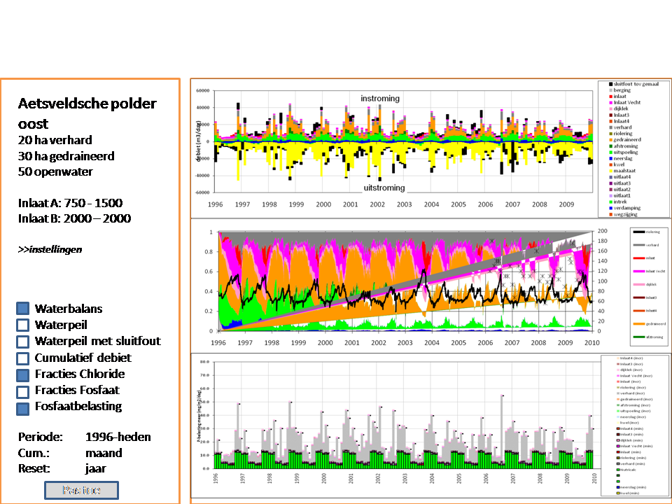

Grafieken
=========

De volgende schermafbeelding toont het scherm als de gebruiker een watergebied
geselecteerd heeft:

Linksboven in het scherm staat algemene informatie over het watergebied:
- de naam
- de oppervlaktes van de bakjes per type oppervlak
- de oppervlakte van het open water
- de minimum en maximum waarde per inlaat
- de minimum en maximum waarde per gemaal

Vervolgens is er een link naar de pagina Instellingen, waar de gebruiker het
model en de gebruikte tijdreeksen kan vastleggen.

In de linkerkolom van de pagina staat een lijst met de grafieken die getoond
kunnen worden. Voor de naam van elke grafiek staat een checkbox. Alleen als die
checkbox geselecteerd, wordt de bijbehorende grafiek getoond in de
rechterkolom.

Daaronder staan een drietaal door de gebruiker in te vullen velden. Het eerste
veld "Periode" specificeert het tijdvenster waarover de grafieken getoond
moeten worden. Het tweede veld "Tijdseenheid" specificeert de tijdseenheid op
de horizontale assen van elke grafiek. De gebruiker kan daarbij kiezen uit de
mogelijkheden "dag", "maand", "kwartaal" en "jaar". Het derde veld "Reset per"
geeft aan wanneer de waardes van de cumulatieve grafieken op nul gezet moeten
worden. De mogelijke keuzes daarbij zijn "maand", "kwartaal" en "jaar".
