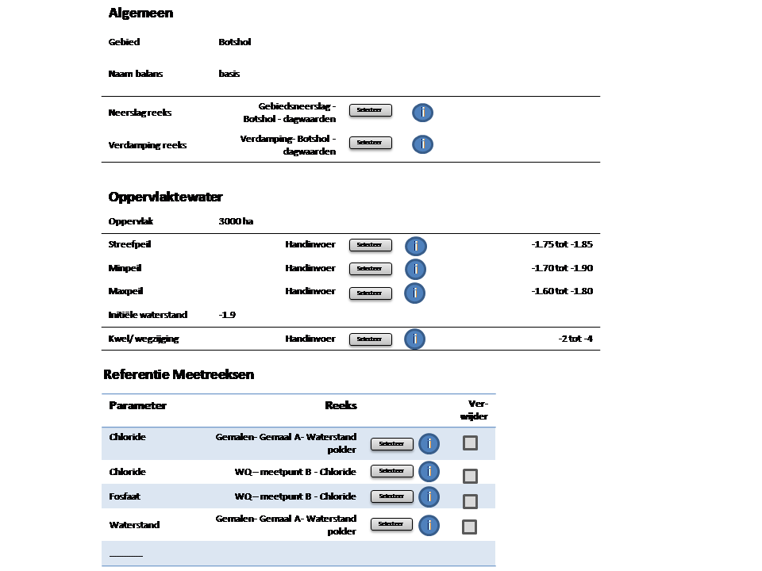
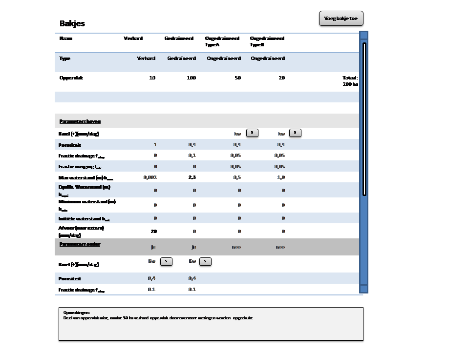
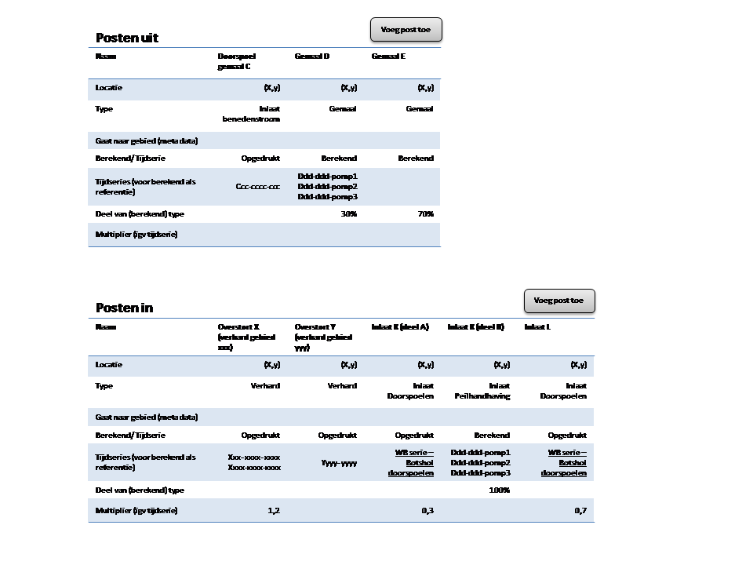
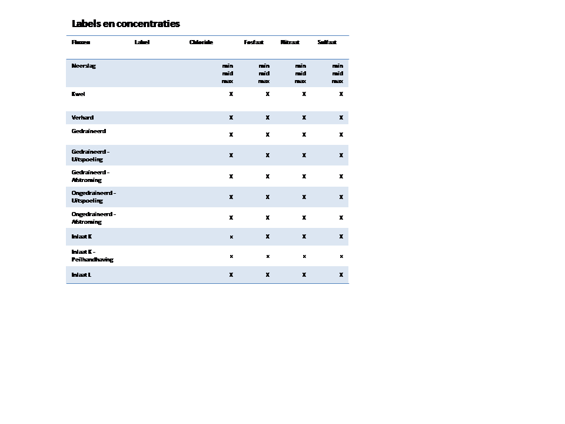

Instellingen
============

De gebruiker beheert de verschillende aspecten van een waterbalansmodel op de
Instellingen pagina. In dit hoofdstuk beschrijven we de verschillende
categorieën instellingen.

Algemeen
--------

De categorie Algemeen beschrijft de instellingen die van toepassing zijn op het
hele watergebied:

Veld *Naam* bevat de naam van het watergebied. Veld *Naam balans* bevat de naam
van het scenario waarvan deze verzameling instellingen deel uitmaakt.

De velden *Neerslag* en *Verdamping* specificeren de tijdreeksen die gebruikt
worden voor neerslag respectievelijk verdamping. Deze tijdreeksen staan in een
FEWS database, waar ze geïdentificeerd worden aan de hand van een drietal
parameters. Drukt de gebruiker op *Selecteer*, kan hij in een pop-up scherm
deze parameters selecteren. De parameters worden vervolgens in het tekstveld
links van de knop getoond. Zijn er nog geen parameters geselecteerd, dan staat
toont het tekstveld de tekst "nog niet geselecteerd".

Rechts van *Selecteer* staat een blauwe knop met een i. Drukt de gebruiker op
deze knop, wordt in een popup scherm de grafiek met die tijdreeks getoond.

Open water
----------

De oppervlakte van het open water dient in vierkante meters ingevuld te worden
(en dus niet in hectares zoals aangegeven in de schermafbeelding). Het
streefpeil van het open water, het minimum peil en het maximum peil zijn
tijdreeksen die handmatig moeten worden gedefinieerd.

Voor de uitleg beperken we ons tot de regel waarin de definitie van het
streefpeil kan worden beheerd. De tekst *handinvoer* geeft aan dat de gebruiker
de tijdreeks zelf moet definiëren. Deze tekst staat er alleen ter informatie en
kan niet door de gebruiker gewijzigd worden. Drukt de gebruiker op *Selecteer*,
kan hij in een pop-up scherm de tijdreeks kan definiëren.

Aan het einde van de regel staat de onder- en bovengrens van het
streefpeil. Deze grenzen staan hier ter informatie en kunnen niet door de
gebruiker gewijzigd worden (behalve door de tijdreeks te wijzigen).

De initiële waterstand bevat de initiële waterstand in meters ten opzichte van
NAP. De rekenmodule gebruikt deze waterstand als startwaarde: moet er een
waterbalans worden berekend die begint op zeg, 1 januari 2010, dan gaat de
rekenmodule ervan uit dat de waterstand aan het begin van die dag op die
initiële waterstand staat.

Tot slot, de gebruiker kan in de laatste regel de tijdreeks definiëren voor
kwel (of wegzijging).

Referentie meetreeksen
----------------------

In de categorie "Referentie meetreeksen" kan de gebruiker de tijdreeksen met
gemeten waarden vastleggen die getekend moeten worden in de grafiek met de
fracties.

De lijst met meetreeksen is initieel leeg. De gebruiker kan reeksen toevoegen
en bestaande reeksen verwijderen. Dat laatste kan door de knop in te drukken
aan het einde van de regel.

We hebben nog niet vastgelegd hoe de gebruiker een reeks kan toevoegen. Dat zou
bijvoorbeeld kunnen door de lijst met meetreeksen altijd met een lege regel af
te sluiten die vervolgens door de gebruiker kan worden ingevuld. Een andere
optie is een knop "Voeg toe".

Bakjes
------

In de categorie "Bakjes" kan de gebruiker de afzonderlijke bakjes vastleggen:

Elke kolom met uitzondering van de eerste specificeert één bakje. De lijst
bakjes is initieel leeg. De gebruiker kan een bakje toevoegen door op de knop
"Voeg bakje toe" te drukken rechtsboven in het scherm. De gebruiker moet ook
een bakje kunnen verwijderen maar we hebben nog niet vastgelegd hoe.

Veld *Naam* bevat de unieke naam van een bakje. Veld *Type* specificeert welk
type grondoppervlak het bakje modelleert. De opties zijn "ongedraineerd",
"verhard" en "gedraineerd". Maakt de gebruiker een nieuw bakje aan, dient deze
standaard het type "ongedraineerd" te krijgen.

Veld *Oppervlak* specificeert het oppervlak van het bakje in vierkante meters
(en dus niet in hectares zoals aangegeven in de schermafbeelding).

Een ongedraineerd oppervlak wordt gemodelleerd door één bakje, maar een verhard
oppervlak en een gedraineerd oppervlak door twee op elkaar gestapelde
bakjes. Dat onderscheid is ook te zien in de gebruikersinterface als
*Parameters boven* en *Parameters onder*.

Veld *Kwel* specificeert de handmatige tijdreeks die gebruikt moet worden voor
kwel dan wel wegzijging. De gebruiker kan de tijdreeks invullen door op *S* te
drukken.

Deze categorie wordt afgesloten met een veld waarin de gebruiker algemene
opmerkingen kan plaatsen.

Posten uit
----------

In de categorie "Posten uit' kan de gebruiker de afzonderlijke gemalen
definiëren:

Elke kolom behalve de eerste specificeert één gemaal. De lijst met gemalen is
initieel leeg. De gebruiker kan een gemaal toevoegen door op de knop "Voeg post
toe" te drukken rechtsboven in het scherm. De gebruiker moet ook een gemaal
kunnen verwijderen maar we hebben nog niet vastgelegd hoe.

Veld *Naam* specificeert de unieke naam van het gemaal. Veld *locatie*
specificeert de coördinaten van het gemaal (maar op dit moment gebruiken we
deze coördinaten nog niet).

In de schermafbeelding staat het veld *Type*. Voor dat veld is er (nog ?) geen
toepassing en moet daarom ook niet geïmplementeerd worden.

De regel "Gaat naar gebied (meta data)" is ...

Veld *Opgedrukt/berekend* geeft aan of de tijdreeks al bekend is (opgedrukt)
is, of dat de rekenmodule deze tijdreeks moet gebruiken voor onder andere
peilhandhaving (berekend). Voor opgedrukte tijdreeksen dient de gebruiker een
tijdreeks uit FEWS te selecteren.

Ook voor een berekende tijdreeks kan de gebruiker één of zelfs meer tijdreeksen
uit FEWS selecteren. Deze tijdreeksen noemen we referentie tijdreeksen en zijn
tijdreeksen met gemeten waarden. Als de gebruiker hier meerdere tijdreeksen
opgeeft, dan zijn dat tijdreeksen voor verschillende pomplijnen bij hetzelfde
gemaal.

Let wel, de schermafbeelding laat niet de knoppen zien die nodig zijn om
tijdreeksen toe te voegen.

Veld *Deel van (berekend) type* specificeert welk deel van de in het kader van
peilhandhaving berekende uitgaande hoeveelheid over welk gemaal gaat. Initieel
is dit percentage 100 % voor de eerste berekende gemaal die de gebruiker
toevoegt. Dit veld is natuurlijk leeg voor gemalen met een opgedrukte
tijdreeks.

Veld *Multiplier (igv tijdreeks)* specificeert een getal waarmee de rekenmodule
de tijdreeks moet vermenigvuldigen alvorens deze te gebruiken.

Posten in
---------

In de categorie "Posten in" definieert de gebruiker de afzonderlijke
inlaten. de opboue van deze categorie is identiek aan die van "Posten uit" en
lichten we daarom ook niet nader toe.

Labels en concentraties
-----------------------

In de categegorie "Labels en concentraties" definieert de gebruiker welk label
elke flux in de grafieken krijgt en welke kleur. Bovendien definieert hij
voor elke stof de concentratie in elke flux. De gebruiker moet deze
concentratie opgeven als handmatige tijdreeks.

Met betrekking tot de labels en kleuren dient nog wel het volgende gezegd te
worden.  Alle fluxen behalve die voor inlaten en gemalen komen in alle grafiek
voor. Die fluxen moeten een vast label en vaste kleur hebben waarmee deze tabel
geïnitialiseerd wordt. De gebruiker moet wel de mogelijkheid hebben om andere
labels en kleuren te kiezen. De fluxen voor inlaten en gemalen dient hij te
alle tijde in te vullen.

